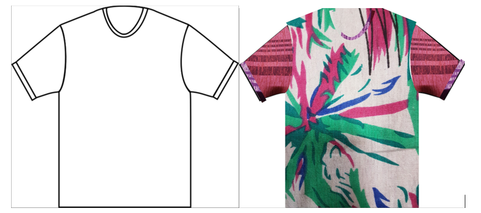
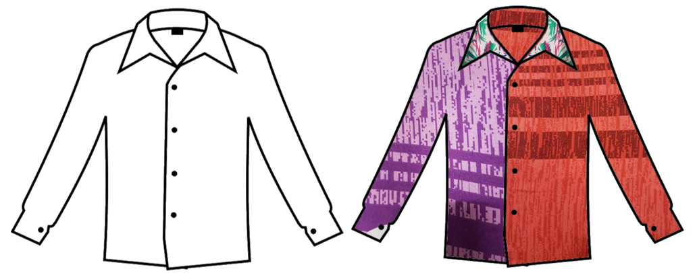
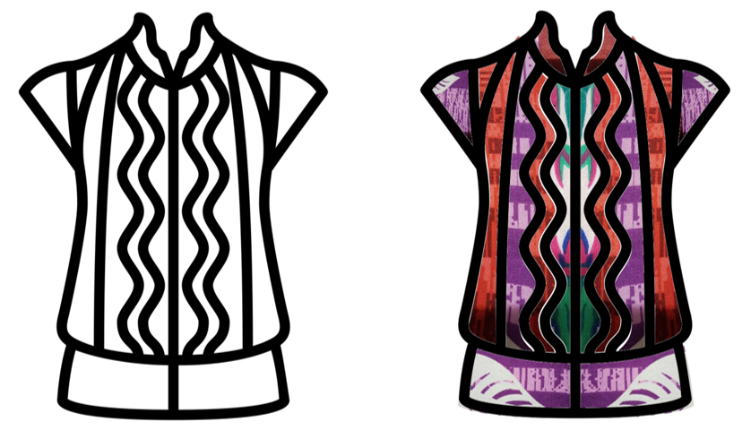

# DesignClothes
An app which helps in generating SVG clothes with patterns and shapes that we see in our surrounding 

## Implemenation Overview

* Initially a plain SVG is displayed to the user, here the user can select the region of the outfit on what he/she would want to apply the pattern.
* Camera module is popped up from where the user can capture the pattern.
* The pattern is initially stored in the storage for later use.
* For every region of the outfit, there is a svg string associated with it.
* The svg String is used to create real image using pathparser algorithm
* A Simple example of path parser for a given string "M150 0 L75 200 L225 200 Z" 
  * M specifies to pick up the pen and move it to 150 0 
  * L specifies to put down the pen and move it to 75 200
  * And then create another line till 225 200
  * Z specifies to draw straight back to the start
  * This creates a simple triangle
  * These are only some commands, using the advanced commands and string, any type of scalable shape can be drawn
* The image of the region is merge with the pattern in the storage using the android graphics library.
* This image of the pattern is overlayed on top of the initial image.
* User can now select a new region to apply a pattern or save this outfit in the storage.

## Example 
* ### T-Shirt 

* ### Shirt

* ### Dress

## Download the apk from [here](https://raw.githubusercontent.com/Not-Rahil/DesignClothes/master/DesignClothes.apk)
